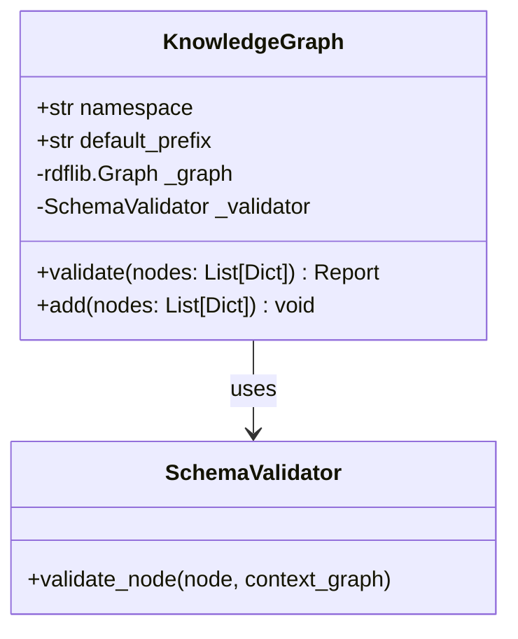

# datacommons-schema

This module provides library methods for validating and working with Data Commons schema. It supports validation of JSON-LD and MCF files, and conversion between the two formats.

## Features

- Schema validation and parsing
- Namespace management
- MCF to JSON-LD conversion
- Compact and expanded JSON-LD output options


## Schema Validation

### Core Concepts

#### 1. Knowledge Graph (KG)
The Knowledge Graph is the central repository for all schema and data nodes.
- **Single Namespace**: The KG operates under a defined namespace (e.g., `https://knowledge-graph.example.org/`).
- **Unified Storage**: Stores both "Schema" (Classes, Properties) and "Data" (Instances) as nodes in the graph.
- **Strict Validation**: No data can be added to the KG without passing validation checks.

#### 2. Schema Validator
The Validator ensures that any data entering the KG conforms to:
- **Standard Primitives**: [RDF](http://www.w3.org/2000/01/rdf-schema#), [RDFS](http://www.w3.org/2000/01/rdf-schema#), and [XSD](http://www.w3.org/2001/XMLSchema#) types.
- **Custom Schema rules**: Domain, Range, and Class existence checks defined within the KG itself.

---

### Class Diagram



## Component Design

### 1. `KnowledgeGraph`
Knowledge graph implementation using `rdflib.Graph` in memory.

**Storage:**
- Uses an instance of `rdflib.Graph` to store all triples.

**Attributes:**
- `namespace`: The base URI for the KG.
- `default_prefix`: The default prefix label (e.g., "ex") that maps to the KG's namespace.

**Methods:**
- `validate(nodes: Union[Dict, List[Dict]]) -> ValidationReport`
    - Checks if the input JSON-LD nodes are valid against the *current* state of the KG.
    - Does *not* modify the graph.
- `add(nodes: Union[Dict, List[Dict]]) -> None`
    - First calls `validate()`.
    - If valid, inserts the nodes into the underlying storage.
    - Raises `ValueError` or custom exception if validation fails.

**Logic:**
- **Add**:
    1. Parse input JSON-LD into a temporary graph.
    2. Run validation against the *combined* knowledge (Current Graph + New Data).
        - *Note*: Validation often requires checking if a referenced Class exists. If we are adding a new Class *and* an instance of it simultaneously, the validator must verify them together.
    3. If valid, merge temporary graph into main `_graph`.

### 2. `SchemaValidationService` (The Validator)
Responsible for the core logic of checking RDF/RDFS/XSD constraints.

**Capabilities:**
- **Primitive Checks**:
    - Ensures `rdf:`, `rdfs:`, `xsd:` terms are known and valid (e.g., rejects `rdf:SomeInvalidProperty`).
- **Integrity Checks (Schema)**:
    - **Classes**: Referenced types must exist (e.g., `@type: "ex:Person"` requires `ex:Person` to be defined as `rdfs:Class`).
    - **Properties**: Referenced predicates must exist (e.g., `"ex:age": 30` requires `ex:age` to be defined as `rdf:Property`).
    - **Domains**: Subject must match the property's `rdfs:domain`.
    - **Ranges**: Object must match the property's `rdfs:range` (either a Class or XSD datatype).

## API & Usage Specification

### Initialization
```python
from datacommons_schema.knowledge_graph import KnowledgeGraph

# Initialize an empty KG with a specific namespace
kg = KnowledgeGraph(namespace="http://example.org/")
```

### Adding Schema
Schema is just data. You add it like any other node.
```python
schema_definition = {
    "@context": {
        "rdf": "http://www.w3.org/1999/02/22-rdf-syntax-ns#",
        "rdfs": "http://www.w3.org/2000/01/rdf-schema#",
        "xsd": "http://www.w3.org/2001/XMLSchema#",
        "ex": "http://example.org/"
    },
    "@graph": [
        {"@id": "ex:Person", "@type": "rdfs:Class"},
        {"@id": "ex:name", "@type": "rdf:Property", "rdfs:domain": {"@id": "ex:Person"}, "rdfs:range": {"@id": "xsd:string"}}
    ]
}

# Validates that 'rdfs:Class' is a known primitive.
# Validates that 'xsd:string' is a known primitive.
kg.add(schema_definition)
```

### Adding Data
```python
person_node = {
    "@context": {"ex": "http://example.org/"},
    "@id": "ex:Alice",
    "@type": "ex:Person",
    "ex:name": "Alice"
}

# 1. Checks if 'ex:Person' exists in KG (It was added above).
# 2. Checks if 'ex:name' exists in KG.
# 3. Checks if 'ex:Alice' satisfies domain of 'ex:name' (ex:Person).
# 4. Checks if "Alice" satisfies range of 'ex:name' (xsd:string).
kg.add(person_node)
```

### Validation Failure Example
```python
invalid_node = {
    "@context": {"ex": "http://example.org/"},
    "@id": "ex:Bob",
    "ex:unknownProp": "Value"
}

# Should raise ValidationException:
# "Property 'ex:unknownProp' is not defined in the Knowledge Graph."
kg.add(invalid_node)
```

## Implementation Roadmap

1.  **Refactor `SchemaValidationService`**:
    *   Decouple it from strictly taking a static schema in `__init__`.
    *   Allow it to accept a "Knowledge Store" interface or lookup function to check for existence of terms during validation.
2.  **Implement `KnowledgeGraph` ABC**:
    *   Define the interface.
3.  **Implement `KnowledgeGraph`**:
    *   Wire up `rdflib` and the Validator.


## Command Line Utilities

### MCF to JSON-LD Converter

The `datacommons-schema mcf2jsonld` command converts MCF files to JSON-LD format, with support for custom namespaces and output formatting.

```bash
# Basic usage
datacommons-schema mcf2jsonld input.mcf

# With custom namespace
datacommons-schema mcf2jsonld input.mcf --namespace "schema:https://schema.org/"

# Output to file with compact format
datacommons-schema mcf2jsonld input.mcf -o output.jsonld -c
```

#### Options

- `mcf_file`: Input MCF file path (required)
- `--namespace`, `-n`: Custom namespace to inject (format: "prefix:url")
- `--outfile`, `-o`: Output file path (defaults to stdout)
- `--compact`, `-c`: Generate compact JSON-LD output

## Module Components

### Converters

The module includes several converters for different schema formats:

- `mcf_to_jsonld`: Converts MCF nodes to JSON-LD format
- Additional converters for other schema formats

### Parsers

- `mcf_parser`: Parses MCF string content into structured nodes
- Support for various MCF syntax elements and properties

### Models

The module defines data models for:

- MCF nodes and properties
- JSON-LD document structure
- Schema validation rules

## Usage Examples

### Python API

```python
from datacommons_schema.parsers.mcf_parser import parse_mcf_string
from datacommons_schema.converters.mcf_to_jsonld import mcf_nodes_to_jsonld

# Parse MCF content
mcf_nodes = parse_mcf_string(mcf_content)

# Convert to JSON-LD
jsonld = mcf_nodes_to_jsonld(mcf_nodes, compact=True)
```

### Command Line

```bash
# Convert with default settings
datacommons-schema mcf2jsonld data.mcf

# Convert with custom namespace and output file
datacommons-schema mcf2jsonld data.mcf -n "dc:https://datacommons.org/" -o output.jsonld

# Generate compact output
datacommons-schema mcf2jsonld data.mcf -c
```

## Dependencies

- Click (for CLI interface)
- Pydantic (for data validation)
- JSON-LD processing libraries

## Contributing

When contributing to this module:
1. Ensure all converters maintain data integrity
2. Add appropriate error handling
3. Include tests for new functionality
4. Update documentation for new features

## License

[Apache License 2.0](https://www.apache.org/licenses/LICENSE-2.0)
