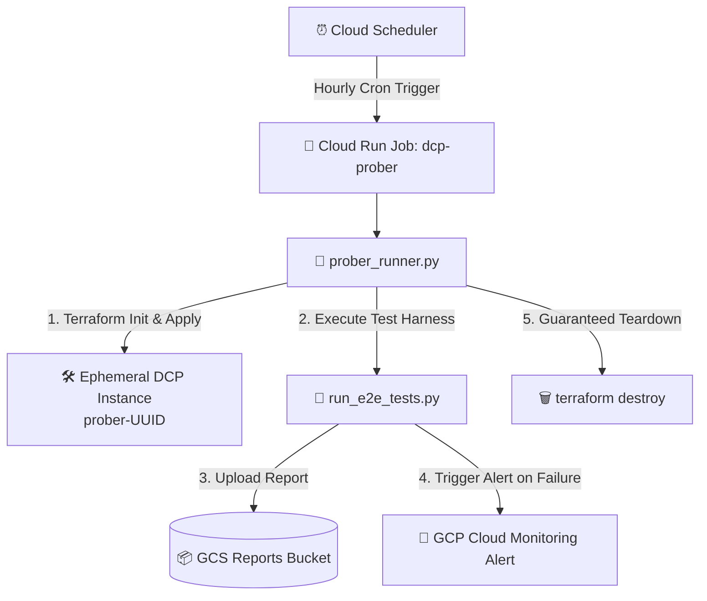

# Data Commons Platform (DCP) — Serverless Ephemeral Prober

An automated, serverless integration prober for the **Data Commons Platform (DCP)**.

The prober automatically provisions a dedicated, ephemeral DCP instance on GCP via Terraform, executes the full end-to-end integration test suite, uploads machine-readable execution reports to GCS, triggers Cloud Monitoring alerts on failure, and guarantees 100% infrastructure teardown.

---

## 🏗️ Architecture Overview



### Key Capabilities
- **State Isolation**: Reuses a single persistent state bucket (`tf-state-dcp-prober-${PROJECT}`) while dynamically generating unique execution prefixes (`ephemeral/prober-{uuid}/default.tfstate`). Eliminates cross-run state pollution and bucket creation rate limits.
- **Guaranteed Cleanup**: Python `try ... finally` blocks and `SIGTERM`/`SIGINT` signal handlers guarantee that `terraform destroy -auto-approve` runs on success, test failure, provisioning error, or container cancellation.
- **Zero Retries at Container Level**: `max_retries = 0` on the Cloud Run Job prevents redundant container executions when a test fails, while internal `prober_runner.py` retries handle transient GCP API rate limits automatically.
- **Interactive Emergency Garbage Collection**: Includes safe cleanup utility (`python3 tests/integration/tools/cleanup_prober_trash.py`) that inspects all 13 GCP resource types and project IAM policy bindings, prompting `[y/N]` before removing any leftover resources.

---

## 🚀 Quick Start & Deployment

### 1. Build Container & Deploy Prober Infrastructure
Run the main deployment script:

```bash
./tests/integration/prober/deploy_prober.sh
```

Or pass the Data Commons API Key directly via CLI flag:

```bash
./tests/integration/prober/deploy_prober.sh --dc-api-key "YOUR_DATACOMMONS_API_KEY"
```

### 2. Fast Deploy (Skip Container Build)
If you only modified Terraform files or environment variables and don't need to rebuild the Docker image:

```bash
./tests/integration/prober/deploy_prober.sh --skip-build
```

---

## 🔐 Cross-Project Artifact Registry Permissions

When deploying the prober to a new GCP Project (`--project <TARGET_PROJECT_ID>`), the target Cloud Run job in that project must have read access to pull the container image from the central Artifact Registry repository (`datcom-tools` in `datcom-ci`).

[`deploy_prober.sh`](file:///Users/gmechali/Desktop/datacommons/datacommons_platform/tests/integration/prober/deploy_prober.sh) handles this automatically during deployment. If deploying manually or via a CI/CD service account, run the following `gcloud` command once to grant the required reader role:

```bash
PROJECT_NUMBER=$(gcloud projects describe <TARGET_PROJECT_ID> --format="value(projectNumber)")

gcloud artifacts repositories add-iam-policy-binding datcom-tools \
  --location=us \
  --project=datcom-ci \
  --member="serviceAccount:service-${PROJECT_NUMBER}@serverless-robot-prod.iam.gserviceaccount.com" \
  --role="roles/artifactregistry.reader"
```

---

## 🧪 Running Prober Runner Locally / Debugging

### Run Full Ephemeral Cycle Locally
```bash
uv run python tests/integration/prober/prober_runner.py \
    --project datcom-dcp \
    --test-config foobar_wages
```

### Retain Ephemeral Resources for Debugging (`--skip-destroy`)
To keep all provisioned GCP resources (Cloud Workflows, Cloud Run services, Spanner databases, logs) alive after test execution for manual inspection:

```bash
uv run python tests/integration/prober/prober_runner.py \
    --project datcom-dcp \
    --test-config foobar_wages \
    --skip-destroy
```

---

## 🧹 Interactive Resource Cleanup Tool

If any past runs left orphaned GCP resources prior to proper cleanup configuration, run the safe, interactive cleanup utility:

```bash
python3 tests/integration/tools/cleanup_prober_trash.py
```

### Inspected Resources (13 GCP Types)
The cleanup script inspects and prompts `[y/N]` before deleting:
1. 📦 **GCS Artifact Buckets** (`gs://prober-[uuid]-dc-artifacts-*`)
2. 🔑 **Secret Manager Secrets** (`prober-[uuid]-dc-*`)
3. 🚀 **Cloud Run Services** (`prober-[uuid]-dc-*`)
4. ⚙️ **Cloud Run Jobs** (`prober-[uuid]-dc-*`)
5. 🔄 **Cloud Workflows** (`prober-[uuid]-dc-*`)
6. 🗄️ **Cloud Spanner Instances** (`prober-[uuid]-dc-instance`)
7. 🔴 **MemoryStore Redis Instances** (`prober-[uuid]-dc-redis-instance`)
8. 🔌 **Serverless VPC Access Connectors** (`prober-[uuid]-dc-vpc-conn`)
9. 👤 **IAM Service Accounts** (`prober-[uuid]-dc-*`)
10. 📊 **BigQuery Connections** (`prober_[uuid]_dc_spanner_connection`)
11. 🔐 **GCP API Keys** (`prober-[uuid]-*`)
12. ⚡ **Active Dataflow Jobs** (`prober-*`)
13. 🛡️ **Orphaned Project IAM Policy Bindings** (`deleted:serviceAccount:prober-*`)

---

## 📂 Directory Structure

```text
tests/integration/prober/
├── Dockerfile              # Multi-stage container build with Terraform & Google Cloud SDK
├── cloudbuild.yaml         # Cloud Build pipeline configuration
├── deploy_prober.sh        # One-click deployment script
├── prober_runner.py        # Resilient orchestrator with state isolation & retry logic
└── terraform/              # Terraform module for Cloud Run Job & Scheduler trigger
    ├── main.tf
    ├── outputs.tf
    └── variables.tf
```
