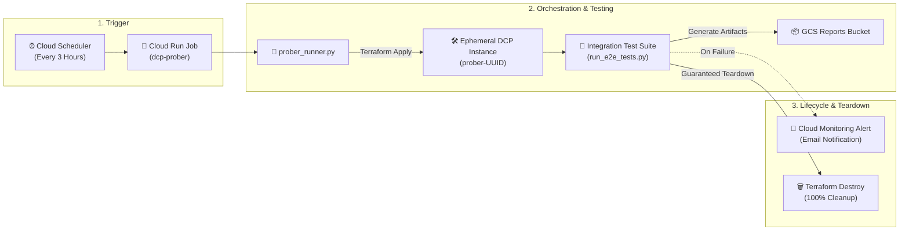

# Data Commons Platform (DCP) — Serverless Ephemeral Prober

An automated, serverless integration prober for the **Data Commons Platform (DCP)**.

The prober continuously provisions an isolated ephemeral DCP instance on GCP via Terraform, executes the full end-to-end integration test suite, uploads machine-readable execution reports to GCS, triggers Cloud Monitoring alerts on failure, and guarantees 100% infrastructure teardown.

---

## 🏗️ Architecture Overview



### Key Capabilities
- **State & Environment Isolation**: Uses unique execution prefixes (`ephemeral/prober-{uuid}/default.tfstate`) in a single state bucket and strictly scopes GCP environment variables to prevent local/inherited quota leakage.
- **Guaranteed Teardown**: Python `try ... finally` blocks and `SIGTERM`/`SIGINT` signal handlers guarantee that `terraform destroy -auto-approve` executes on test failure, uncaught exception, or container cancellation.
- **Structured Cloud Logging & Instant Alerts**: Emits single-line structured JSON logs (`jsonPayload`) for Cloud Logging, triggering dual-condition Cloud Monitoring email alerts instantly (`0s` evaluation duration) on any test or job failure.
- **Full Platform Lifecycle Coverage**: Tests the entire live stack in sequence — Terraform Provisioning $\to$ Ingestion Dataflows $\to$ SVG Hierarchy & Embeddings $\to$ REST & SDMX 3.0 APIs $\to$ MCP Agents $\to$ 100% Teardown.

---

## 🚀 Quick Start & Deployment

### 1. Deploy Prober Infrastructure
Run the main deployment script:

```bash
./tests/integration/prober/deploy/deploy_prober.sh \
  --project datcom-dcp \
  --prober-name dcp-prober \
  --test-config foobar_wages \
  --schedule "0 */3 * * *" \
  --alert-email datacommons-alerts+dcp-prober@google.com \
  --location us-central1 \
  --dc-api-key "YOUR_DATACOMMONS_API_KEY" \
  --non-interactive
```

> **Note on Interactive Mode**: If you run `./tests/integration/prober/deploy/deploy_prober.sh` without flags, it automatically detects your active `gcloud` project (`datcom-dcp`) and interactively prompts for any optional configuration overrides.

### 2. Fast Deploy (`--skip-build`)
If you only modified Terraform files or environment settings and do not need to rebuild the Docker image:

```bash
./tests/integration/prober/deploy/deploy_prober.sh --skip-build
```

---

## ☁️ Deployed Cloud Infrastructure & Resource Links

Prober infrastructure and cron schedules are deployed via Terraform with **Remote State Management** stored in Google Cloud Storage:

* **Cloud Run Job**: [Cloud Run Job: `dcp-prober`](https://console.cloud.google.com/run/jobs/details/us-central1/dcp-prober/executions?project=datcom-dcp)
* **Cloud Scheduler Trigger**: [Cloud Scheduler Job: `dcp-prober-cron`](https://console.cloud.google.com/cloudscheduler/jobs/edit/us-central1/dcp-prober-cron?project=datcom-dcp)
* **Active Integration Test Config**: [`foobar_wages`](https://github.com/datacommonsorg/datacommons/blob/main/tests/integration/test_data/foobar_wages/test_spec.yaml) (exercises 1,242 observations, SVG hierarchy, Vertex AI natural language embeddings, REST/SDMX 3.0 APIs, and MCP tools)
* **Terraform Remote State Bucket**: [`gs://tf-state-dcp-prober-datcom-dcp`](https://console.cloud.google.com/storage/browser/tf-state-dcp-prober-datcom-dcp?project=datcom-dcp)
* **Container Image in Artifact Registry**: [`us-docker.pkg.dev/datcom-ci/datcom-tools/datacommons-platform-prober:latest`](https://console.cloud.google.com/artifacts/docker/datcom-ci/us/datcom-tools/datacommons-platform-prober?project=datcom-ci)
* **Prober Data Commons API Key**: [Secret Manager: `dcp-prober-api-key`](https://console.cloud.google.com/security/secret-manager/secret/dcp-prober-api-key/versions?project=datcom-dcp)

---

## 🔐 Cross-Project Artifact Registry Permissions

`deploy_prober.sh` automatically grants `roles/artifactregistry.reader` on the `datcom-ci` Artifact Registry to the target project's Cloud Run Service Agent. If deploying via custom CI/CD service accounts, ensure the target project robot account (`service-${PROJECT_NUMBER}@serverless-robot-prod.iam.gserviceaccount.com`) has reader access on the repository.

---

## 🧪 Running Prober Runner Locally / Debugging

### Run Full Ephemeral Cycle Locally
```bash
uv run python tests/integration/prober/prober_runner.py \
    --project datcom-dcp \
    --test-config foobar_wages
```

### Retain Ephemeral Resources for Debugging (`--skip-destroy`)
To keep all provisioned GCP resources (Cloud Workflows, Cloud Run services, Spanner databases, logs) alive after test execution for manual inspection:

```bash
uv run python tests/integration/prober/prober_runner.py \
    --project datcom-dcp \
    --test-config foobar_wages \
    --skip-destroy
```

---

## 🧹 Interactive Resource Cleanup Tool

If a debugging session with `--skip-destroy` or an unexpected cancellation leaves temporary `prober-*` resources behind, run the interactive cleanup janitor:

```bash
python3 tests/integration/prober/tools/cleanup_prober_trash.py
```

This tool safely scans and prompts before removing any orphaned `prober-*` Spanner instances, Cloud Run services, buckets, IAM bindings, or API keys.
